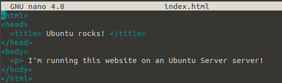
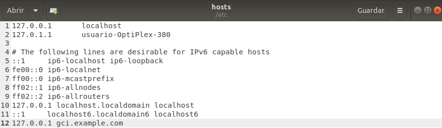

# APACHE

[Javier Hermoso](https://github.com/hermo18)


### RESUMEN

En este documento se va a hablar sobre el servidor HTTP **Apache** de una manera clara para que sea entendido por usuarios primerizo. En primer lugar se redactará un poco sobre su historia y orígen, seguidamente cual es el propósito de **Apache**.  
Seguidamente se explicará como instalar **Apache** en nuestro sistema **Ubuntu** indicando detalladamente los pasos a seguir para evitar cualkquier tipo de errores.  
Por último la guía de **configuración** para poder iniciar nuestro servidor con nuestra propia web en local, pasando antes por la configuración de puertos y de la **URL** personalizada.

### PALABRAS CLAVE

* Servidor
* HTTP
* Linux
* C
* WWW

## ÍNDICE

1. Introducción  
  1.1. ¿Qué es Apache?  
  1.2. Historia  
2. Tutorial  
  2.1. Instalación  
    - 2.1.1. Instalar Apache  
    - 2.1.2. Configurar cortafuegos Apache  
    - 2.1.3. Configurar cortafuegos Apache  
    - 2.1.4. Verificar servidor web.  

    2.2. Configuración
3. Bibliografía

## 1. INTRODUCCIÓN

### 1.1 ¿QUÉ ES APACHE?
Apache es un servidor web de de código abierto, multiplataforma y gratuito. Este web server es uno de los más utilizados en el mundo, actualmente el 43% de los sitios webs funcionan con él.
### 1.2 HISTORIA

En marzo de 1989 [Tim Berners Lee](https://es.wikipedia.org/wiki/Tim_Berners-Lee), un científico británico que trabajaba en el [CERN](https://es.wikipedia.org/wiki/Organizaci%C3%B3n_Europea_para_la_Investigaci%C3%B3n_Nuclear). Berners propone una nueva forma de gestionar toda la información de los proyectos del **CERN**.

Este se trataba de una red de documentos enlazados la **WWW**. Sin emabrgo no fue hasta 1996 cuando ya se estrenó la versión 1.0 de Apache la cual ya incluyó funciones muy interesantes comom [MySQL](https://www.mysql.com/) que apareció en la **1.1**.

El nombre de Apache se debe a la filosofía de desarrollo y de organización. Al igual que la tribu de los apaches.

## 2. TUTORIAL

El siguiente tutorial nos va a explicar como instalkar el servidor Apache en nuestro sistema **Ubuntu**.

### 2.1. INSTALACIÓN

Para poder instalar Apache vamos a tener que ejecutar los siguinetes comandos en nuestro terminal.

**Instalar Apache**

>sudo apt update 

>sudo apt install apache2

**Configurar cortafuegos**

>sudo ufw app list

Una vez ingresado ese comando nos deberá aparecer un listado como este:

```
Available applications:
  Apache
  Apache Full
  Apache Secure
  OpenSSH
```
Ahora lo que tenemos que hacer es habilitar el Apche con este código:

>sudo ufw allow 'Apache'

Y para comprobar que todo esté correcto:

>sudo ufw status

Si todo ha salido bien la salida deberá de ser la siguiente:

```
Status: active

To                         Action      From
--                         ------      ----
OpenSSH                    ALLOW       Anywhere                  
Apache                     ALLOW       Anywhere                  
OpenSSH (v6)               ALLOW       Anywhere (v6)             
Apache (v6)                ALLOW       Anywhere (v6)
```

**Verificar el servidor web**

Para saber si Apache está funcionando podremos ejecutar lo siguiente:

>sudo systemctl status apache2

Como podremos ver, en la 5ª línea debe de aparecer *active (running)*.

```
● apache2.service - The Apache HTTP Server
   Loaded: loaded (/lib/systemd/system/apache2.service; enabled; vendor preset: enabled)
  Drop-In: /lib/systemd/system/apache2.service.d
           └─apache2-systemd.conf
   Active: active (running) since Tue 2018-04-24 20:14:39 UTC; 9min ago
 Main PID: 2583 (apache2)
    Tasks: 55 (limit: 1153)
   CGroup: /system.slice/apache2.service
           ├─2583 /usr/sbin/apache2 -k start
           ├─585 /usr/sbin/apache2 -k start
           └─2586 /usr/sbin/apache2 -k start
```

Si todo ha funcionado corectamente ahora podremos acceder a nuestra web con el comando:

>hostname -I

Y deberemos escribir esa IP en el navegador .

Veremos algo parecido a esto:


**Comandos útiles**

- *Apagar Apache:* 
>sudo systemctl stop apache2

- *Iniciar Apache:*
>sudo systemctl start apache2

- *Detener y reiniciar Apache:*
>sudo systemctl restart apache2

- *Impedir que Apache se inicie cuando enciendes el servidor:*
>sudo systemctl disable apache2

- *Permitir que Apache se inicie cuando enciendes el servidor:*
>sudo systemctl enable apache2


### 2.1. CONFIGURACIÓN

Primero que todo deberemos crear una carpeta con el nombre **gci** dentro de la siguiente ruta

>/var/www/

Una vez creada deberemos colocarnos dentro de ella con elk siguiente comando:

>cd /var/www/gci

Una vez dentro, deberemos de crear el archivo **index.html** de la siguiente manera:

>nano index.html

Y escribir algo como esto:



A continuación queremos editar el archivo **gci.confg**, pero para ello primero debemos dirigirnos a la ruta donde se encuentra:

>cd /etc/apache2/sites-available/

Una vez ahi queremos copiar un archivo y cambiarle el nombre a **gci.conf**:

>cp 000-default.conf gci.conf

Ahora para lo deberemos editar con la instrucción **nano**.


Deberemos cambiar el **ServerAdmin** y poder nuestro mail.

Seguidamente deberemos iniciar la configuración: 
>a2ensite gci.conf

Y el resultado debe de ser este: 

```
Enabling site gci.
To activate the newq configuration, you need to run:
  Systemctl reload apache2
```
Le hacemos caso y ejecutamos el ultimo comando.

Sin embargo esto no funciona todavía, tenemos que incluir nuesra URL dentro del fichero **hosts** el cual se encuetra en la carpeta **etc**:



Ahora introducimos la URL en nuestro navegador y si todo funciona veremos algo así:


Para quitar la configuración y volver al estado inicial debermos escrbiri lo siguiente y posteriormente reiniciar el PC:
>a2disite gci.conf

## 3. BIBLIOGRAFÍA
- [QUÉ ES APACHE](https://www.webempresa.mx/hosting/que-es-servidor-apache.html)
- [HISTORIA APACHE](https://es.wikipedia.org/wiki/Servidor_HTTP_Apache)
- [IMÁGENES DE CONFIGURACIÓN CEDIDAS POR RAÚL CUBERO DEBIDO A PROBLEMAS TÉCNICOS](#)
